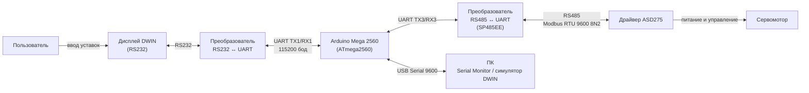
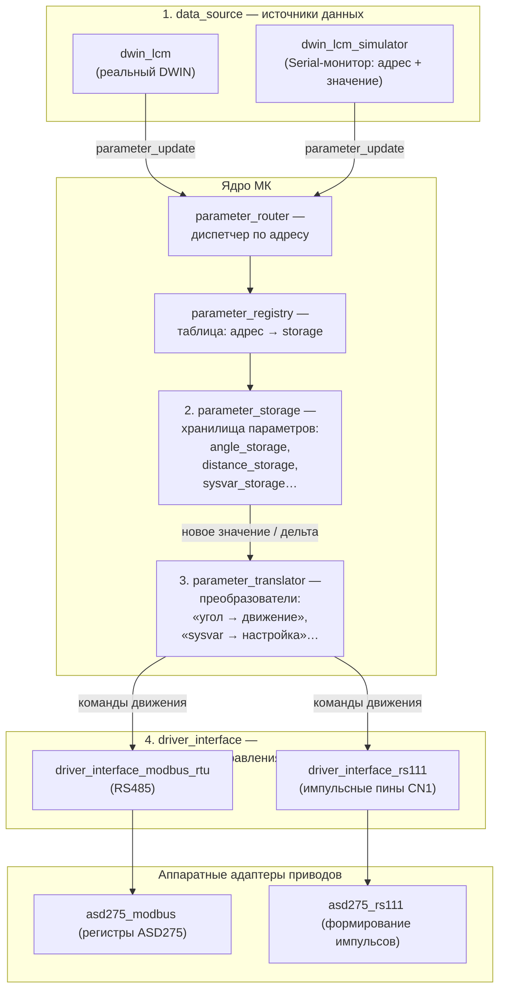
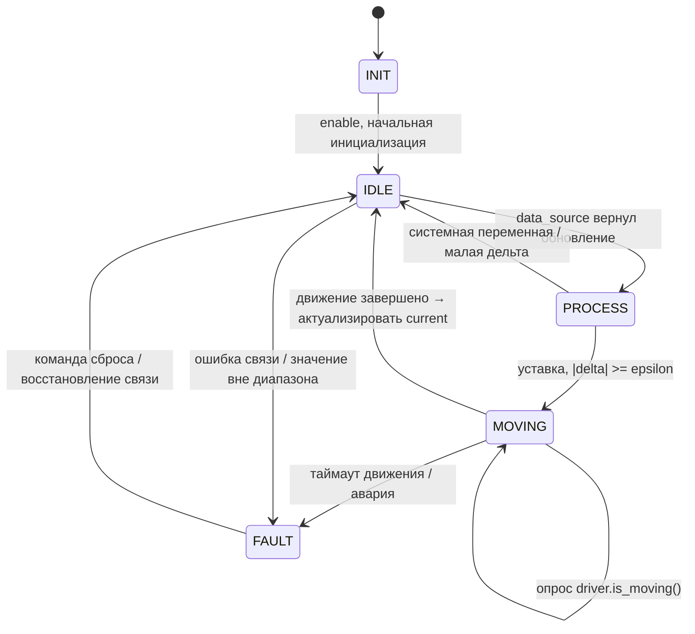

# mega_ASD275

Прошивка для **Arduino Mega 2560**, которая управляет сервоприводом **ASD275** по данным, получаемым с дисплея **DWIN** (в отладке — с его симулятора).

Документ описывает **целевую модульную архитектуру** прошивки, алгоритмы работы устройства, порядок вызовов модулей и содержит блок-схему устройства и блок-схему модулей. Раздел [6](#6-ревизия-текущего-кода) фиксирует расхождения текущего кода с этой архитектурой.

---

## 1. Назначение системы

Устройство представляет собой станцию, в которой:

1. Пользователь задаёт на дисплее DWIN технологические параметры:
   - **угол поворота станины**;
   - **расстояние от нулевой точки до упора**;
   - **системные переменные** (настройки взаимодействия с подключёнными устройствами).
2. Микроконтроллер принимает параметры, хранит текущее состояние, а для системных параметров вычисляет **дельту** (изменение относительно текущего состояния).
3. Дельта преобразуется в **команды управления драйвером** ASD275, и сервопривод отрабатывает перемещение.

### 1.1. Состав оборудования

| Элемент | Интерфейс | Подключение к МК |
|---|---|---|
| Дисплей DWIN | RS232 | через преобразователь RS232-UART |
| Драйвер ASD275 | RS485 (Modbus RTU) и RS111 (импульсные пины) | RS485 — через преобразователь RS485-UART |
| ПК (отладка) | USB | Serial Monitor / симулятор DWIN |

### 1.2. Блок-схема устройства



> Схема соединений приведена по текущему состоянию кода (`servo_driver.h`, `main.cpp`). Она **требует проверки на реальном железе** — в коде сохранились устаревшие комментарии про управление импульсами по CN1 (см. [6](#6-ревизия-текущего-кода)).

### 1.3. Таблица подключения Arduino Mega 2560

| Пин Arduino | Куда | Примечание |
|---|---|---|
| D18 (TX1) | RX преобразователя RS232-UART → TX дисплея DWIN | DWIN, 115200 бод |
| D19 (RX1) | TX преобразователя RS232-UART ← RX дисплея DWIN | |
| D14 (TX3) | DI преобразователя RS485-UART (SP485EE) | Modbus RTU к ASD275, 9600 8N2 |
| D15 (RX3) | RO преобразователя RS485-UART (SP485EE) | |
| D2 | RSE преобразователя RS485-UART | HIGH — передача, LOW — приём |
| D0/D1 (USB) | ПК | Отладка / ввод команд симулятора, 9600 бод |

---

## 2. Модули прошивки (целевая архитектура)

Прошивка строится на четырёх ключевых абстракциях. Все связи выполняются **через интерфейсы**, конкретные реализации подставляются на этапе сборки (compisition root в `main.cpp`) — это позволяет менять дисплей, драйвер и транспорт независимо.

### 2.1. Блок-схема модулей



### 2.2. `data_source` — источник данных

Интерфейс модуля «источник данных». Отдаёт **событие обновления параметра**: адрес и значение.

```cpp
struct parameter_update {
    uint16_t address;   // адрес параметра (VP дисплея DWIN / ключ источника)
    int32_t  raw_value; // «сырое» значение из источника
};

class data_source {
public:
    virtual ~data_source() {}
    // Неблокирующее чтение очередного обновления.
    virtual bool try_read_update(parameter_update& out) = 0;
};
```

Реализации:

| Класс | Устройство | Источник | Формат события |
|---|---|---|---|
| `dwin_lcm` | DWIN (RS232) | кадры протокола DWIN | изменение VP → `{vp_addr, value}` |
| `dwin_lcm_simulator` | ПК (Serial Monitor) | строки из Serial | `"ADDR VALUE"` (например, `0x5002 4500`) |

### 2.3. `parameter_storage` — хранилище параметра

Одна реализация интерфейса = **один параметр** устройства. Хранит текущее значение, умеет принять новое значение, а для системных параметров — вычислить дельту и передать её в преобразователь.

```cpp
class parameter_storage {
public:
    virtual ~parameter_storage() {}

    virtual uint16_t address() const = 0;          // ключ в реестре
    virtual bool     is_system_value() const = 0;  // true — «уставка», порождает движение

    // Сохранить новое значение; при изменении системного параметра —
    // вызвать связанный parameter_translator.
    virtual bool apply_update(int32_t raw_value) = 0;

    virtual int32_t current_raw() const = 0;       // текущее значение (сырое)
};

// Реестр: «адрес параметра → его хранилище».
class parameter_registry {
public:
    parameter_storage* find(uint16_t address);
    void register_storage(parameter_storage& storage);
};
```

Примеры хранилищ:

| Хранилище | Параметр | Тип |
|---|---|---|
| `angle_storage` | Угол поворота станины | системный параметр (уставка) |
| `distance_storage` | Расстояние от нулевой точки до упора | системный параметр (уставка) |
| `speed_storage` | Скорость вращения привода | системная переменная |
| `scale_storage` | Передаточное число (напр. 1/100 ° на оборот) | системная переменная |
| `slave_addr_storage` | Адрес/скорость Modbus-сети | системная переменная |

### 2.4. `parameter_translator` — преобразователь «параметр → команды»

Преобразует **новое состояние параметра** (хранилище) в **набор команд** для `driver_interface`. Один транслятор привязан к одному системному параметру.

```cpp
class parameter_translator {
public:
    virtual ~parameter_translator() {}

    // Вызывается хранилищем после обновления значения.
    virtual void on_storage_changed(parameter_storage& storage) = 0;
};
```

Пример алгоритма для «угла поворота станины»:

1. Взять из хранилища новое целевое значение и текущее значение.
2. `delta = target − current`.
3. Если `|delta| < epsilon` — движения не требуется.
4. Перевести физическую дельту в команды привода:
   - направление — знак дельты;
   - величину (обороты/импульсы) — по системным переменным (масштаб, передаточное число);
   - скорость — из системной переменной.
5. Вызвать `driver_interface` и вернуть статус запуска.

> Реализация транслятора зависит от **типа параметра** (семантика уставки), от **типа драйвера** и от **интерфейса управления**. Чтобы избежать «взрыва комбинаторики» (параметр × драйвер × транспорт), физически-логическая часть (шаги 3–4) отделяется от транспорта: различия транспорта и модели привода инкапсулируются в реализациях `driver_interface`, а транслятор работает с логическими командами движения.

### 2.5. `driver_interface` — интерфейс управления драйвером

Абстракция привода на уровне **логических команд движения**.

```cpp
class driver_interface {
public:
    virtual ~driver_interface() {}

    virtual bool enable()  = 0;                    // включить привод (один раз при старте)
    virtual bool disable() = 0;
    virtual bool move(int32_t revolutions, uint16_t rpm) = 0; // относительное перемещение
    virtual bool set_speed(uint16_t rpm) = 0;      // изменить скорость
    virtual bool stop() = 0;                       // плановая остановка
    virtual bool emergency_stop() = 0;             // аварийная остановка
    virtual bool is_moving() = 0;                  // идёт ли движение
    virtual bool has_fault() = 0;                  // есть ли авария привода
};
```

Реализации:

| Класс | Транспорт | Описание |
|---|---|---|
| `driver_interface_modbus_rtu` | RS485, Modbus RTU | обмен регистрами (для ASD275: 0x202 — обороты, 0x204 — скорость, 0x11F — старт/сброс, 0xB5 — enable, 0x1000 — мониторинг) |
| `driver_interface_rs111` | RS111 (пины CN1) | формирование импульсов PULS/SIGN, импульс на оборот |

Модель конкретного привода (набор регистров, коэффициенты) учитывается **адаптером** внутри реализации интерфейса (например, `asd275_modbus`), чтобы трансляторы и верхняя логика не зависели от модели.

### 2.6. Служебные модули

| Модуль | Назначение |
|---|---|
| `parameter_router` | Принимает обновления от `data_source`, по адресу находит хранилище в `parameter_registry` и вызывает `apply_update()`. Неизвестный адрес — логируется и игнорируется. |
| `state_machine` | Неблокирующий конечный автомат главного цикла (IDLE / MOVING / FAULT и т.п.). |
| `eeprom_config` | Сохранение текущих значений параметров между перезагрузками. |
| `log` | Централизованный вывод диагностики в Serial (убирает `Serial.print` из драйверов/логики). |

---

## 3. Алгоритмы работы

### 3.1. Общий порядок обработки (по шагам)

1. Пользователь вводит значение параметра на DWIN (или вводит `"адрес значение"` в симуляторе).
2. МК получает данные от источника (`data_source::try_read_update`).
3. МК по **адресу параметра** определяет хранилище (`parameter_router` → `parameter_registry`).
4. МК вызывает `parameter_storage::apply_update()`, хранилище сохраняет значение.
5. Если параметр — системный (уставка), хранилище вычисляет **дельту** и вызывает `parameter_translator`.
6. Транслятор преобразует дельту в **команды управления**.
7. Транслятор вызывает `driver_interface`, тот выполняет управление приводом.
8. ASD275 изменяет положение сервопривода.

### 3.2. Диаграмма последовательности обработки параметра

```mermaid
sequenceDiagram
    participant USER as Пользователь (DWIN/симулятор)
    participant DS as data_source
    participant RT as parameter_router
    participant REG as parameter_registry
    participant ST as parameter_storage
    participant TR as parameter_translator
    participant DI as driver_interface
    participant DRV as ASD275 + мотор

    USER->>DS: ввод: (address, value)
    DS->>RT: try_read_update() → parameter_update{address, value}
    RT->>REG: find(address)
    REG-->>RT: parameter_storage*
    RT->>ST: apply_update(value)

    alt системный параметр (уставка: угол/расстояние)
        ST->>ST: сохранить target; delta = target − current
        Note over ST: |delta| >= epsilon
        ST->>TR: on_storage_changed(storage)
        TR->>TR: физика: delta → обороты/скорость/направление
        TR->>DI: move(revolutions, rpm)
        DI->>DRV: Modbus: 0x202, 0x204, 0x11F=1→0
        DI-->>TR: статус запуска
        TR-->>ST: движение начато
        ST-->>RT: ok
    else системная переменная (настройка)
        ST->>DI: применить настройку (скорость/коэффициент/адрес)
        ST-->>RT: ok
    end
```

### 3.3. Главный цикл и состояния МК

Главный цикл **неблокирующий**: вместо длинных `delay()` используются периодические задачи и таймауты. Это позволяет принимать системные переменные даже во время движения.



Таймауты и страховки:

| Ситуация | Поведение |
|---|---|
| Нет данных от источника | оставаться в IDLE, продолжать опрос |
| Привод движется | не принимать новые уставки для этого параметра; системные переменные — принимать |
| Движение «зависло» | аварийная остановка, переход в FAULT |
| Авария привода (Modbus-исключение) | логирование, переход в FAULT |
| Значение параметра вне диапазона | отклонение, логирование |

### 3.4. Стек вызовов (полная цепочка)

```
loop()
└─ state_machine.tick()
   └─ if (IDLE):
      └─ data_source.try_read_update(update)
         └─ parameter_router.route(update)
            └─ parameter_registry.find(update.address)
            └─ parameter_storage.apply_update(update.raw_value)
               ├─ [не системный параметр] → сохранение, конец
               └─ [системный параметр] → delta = target − current
                  └─ parameter_translator.on_storage_changed(storage)
                     └─ (физика) delta → направление, обороты, rpm
                     └─ driver_interface.move(revolutions, rpm)
                        ├─ [Modbus RTU] asd275_modbus:
                        │    write 0x202(обороты) → write 0x204(rpm)
                        │    → write 0x11F=1 → write 0x11F=0
                        └─ [RS111] asd275_rs111:
                             установка направления → выдача N импульсов
   └─ if (MOVING):
      └─ driver_interface.is_moving()
         └─ [Modbus RTU] read 0x1000 (≠0 — вращается)
```

---

## 4. Таблица параметров и адресов (проектная)

> Значения адресов — **проектные**, уточняются по конфигурации страниц DWIN.

| VP (DWIN) | Параметр | Единицы / масштаб | storage | translator → driver |
|---|---|---|---|---|
| `0x5002` | Угол поворота станины | 0.01 ° | `angle_storage` | `angle → движение` (ось станины) |
| `0x5004` | Расстояние от нулевой точки до упора | 0.01 мм | `distance_storage` | `distance → движение` (ось подачи) |
| `0x6000` | Скорость привода | об/мин | `speed_storage` | sysvar → `set_speed` |
| `0x6002` | Масштаб «градус → обороты» | 1/100 °/об | `scale_storage` | sysvar → коэффициенты транслятора |
| `0x6004` | Адрес Modbus (PA71) | 1..254 | `addr_storage` | sysvar → конфигурация Modbus |

Применяется единое правило масштабирования: сырое значение × масштаб параметра → физическая величина. Масштаб задаётся **в описании параметра**, а не «магической константой» в коде.

---

## 5. Отладка и симуляция

- **Симулятор DWIN** (`USE_DWIN_LCM_SIMULATOR`): вместо реального дисплея параметры вводятся в Serial Monitor как пара `адрес значение` (например `0x5002 4500`).
- **Симулятор сервопривода** (`USE_SERVO_SIMULATOR`): имитирует движение (без реального ASD275) для отладки логики.
- Сборка/заливка — PlatformIO (`pio run`, `pio run -t upload`), монитор — `pio device monitor`.
