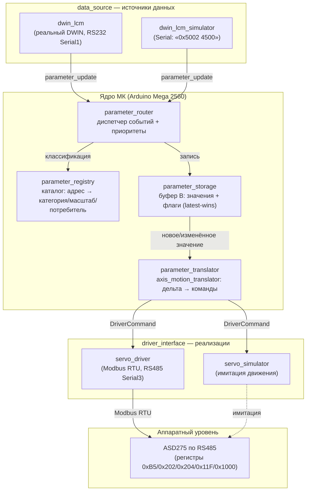

# Карта модулей

## Назначение

Целевая архитектура прошивки — линейная цепочка абстракций, все связи выполняются **через интерфейсы**, конкретные реализации подставляются на этапе сборки (composition root в `src/main.cpp`) (раздел 2 [README.md](../../README.md), раздел 1 [base-design.md](../sessions/base/artifacts/base-design.md)).

```
data_source → parameter_router → parameter_registry → parameter_storage → parameter_translator → driver_interface
```

## Модуль → ключевые типы/интерфейсы → файлы → назначение

| Модуль | Ключевые типы/интерфейсы | Файлы (по разделу 7 дизайна) | Назначение |
|---|---|---|---|
| Источник данных | `data_source`, `parameter_update` | `include/data_source.h`; `lib/dwin_lcm/*`, `lib/dwin_lcm_simulator/*` | Единственный источник данных. Отдаёт события «адрес VP, raw-значение»; не знает категорий и устройств |
| Диспетчер | `parameter_router` | `include/parameter_router.h` (+ `src/parameter_router.cpp`) | Входная точка цикла: принимает события, через реестр определяет категорию, пишет в хранилище, применяет приоритет обработки |
| Каталог параметров | `parameter_registry`, `ParameterDescriptor`, `Category` | `include/parameter_registry.h` (+ `src/parameter_registry.cpp`) | Статический каталог описаний параметров (адрес, категория, масштаб, единица, потребитель). **Не хранит значений** |
| Хранилище значений | `parameter_storage`, `scaled_parameter`, `axis_settings` | `include/parameter_storage.h`, `include/scaled_parameter.h`, `include/axis_settings.h` (+ `src/*.cpp`) | Таблица текущих значений и флагов изменения; единственное место, где значения живут между проходами цикла |
| Преобразователь | `parameter_translator`, `axis_motion_translator` | `include/parameter_translator.h`, `include/axis_motion_translator.h` (+ `src/axis_motion_translator.cpp`) | Превращает значения из хранилища в команды драйвера (цель движения, скорость); работает в физических величинах |
| Драйвер | `driver_interface` | `include/driver_interface.h`; `lib/servo_driver/*` (Modbus RTU), `lib/servo_simulator/*` (имитация) | Транспортно-зависимая выдача команд по интерфейсу устройства (RS485; в перспективе RS111) |
| Адреса | константы VP | `include/parameter_addresses.h` | Константы адресов (0x5002, 0x5004, 0x6000, 0x6002, 0x6004) и их комментарии |
| Главный цикл | — | `src/main.cpp` | Композиция модулей, `setup()`, неблокирующий `loop()` с фиксированным порядком шагов |

Планируемые файлы и сигнатуры целевых контрактов — раздел 8 [base-design.md](../sessions/base/artifacts/base-design.md). Разделы 4.2–4.5 [base-requirements.md](../sessions/base/artifacts/base-requirements.md) задают требования FR-4..FR-14 для реестра, хранилища, транслятора и драйвера.

> **Особенность целевой архитектуры (отличие от текущего кода, из артефактов аналитика):** в дизайне `parameter_registry` — это каталог **дескрипторов** (адрес, категория, масштаб, единица, потребитель), не хранящий значений, а `parameter_storage` — общая **таблица значений** с API `write/read/hasChanged/clearChanged` (раздел 8 дизайна). Текущий код содержит более раннюю редакцию интерфейсов (хранилище на параметр с `apply_update`, реестр указателей на хранилища) — она используется только как справочный контекст имён и сигнатур.

## Схема модулей



## Связи и зависимости (кто кого вызывает)

| Модуль | Вызывает | Вызывается из |
|---|---|---|
| `data_source` (`dwin_lcm`, `dwin_lcm_simulator`) | — | `parameter_router` (опрос в главном цикле); `src/main.cpp` (периодическое чтение RAM DWIN) |
| `parameter_router` | `parameter_registry::find`, `parameter_storage::write`, `parameter_storage::clearChanged` | `src/main.cpp::loop()` |
| `parameter_registry` | — (каталог, только чтение) | `parameter_router`, `src/main.cpp` (регистрация в `setup()`) |
| `parameter_storage` | `parameter_translator` (через флаг «изменился» и уведомление) | `parameter_router`, `parameter_translator` (чтение для дельты) |
| `parameter_translator` (`axis_motion_translator`) | `parameter_storage` (чтение), `driver_interface` (команды), `axis_settings` (кэш настроек) | `parameter_storage` (уведомление), `src/main.cpp::loop()` (`tick()`) |
| `driver_interface` (`servo_driver`) | RS485 (Serial3), пин RSE (D2) | `parameter_translator`, `src/main.cpp::loop()` (`tick()`) |

Правило композиции: интерфейсы объявлены в `include/`, реализации — в `lib/`; выбор симулятора/реального устройства — флагами сборки в `platformio.ini` (строки 26, 28).

## Развитие (модель «источник один, устройств много»)

- Новое устройство = новый экземпляр `driver_interface` + строки в реестре (адрес, категория, потребитель) + при необходимости новый транслятор, читающий то же хранилище.
- Роутер и главный цикл не изменяются (раздел 6 [base-design.md](../sessions/base/artifacts/base-design.md)).

## Ссылки

- Диаграмма последовательности: [flow.md](./flow.md).
- Принципы, заложенные в архитектуру: [principles.md](./principles.md).
